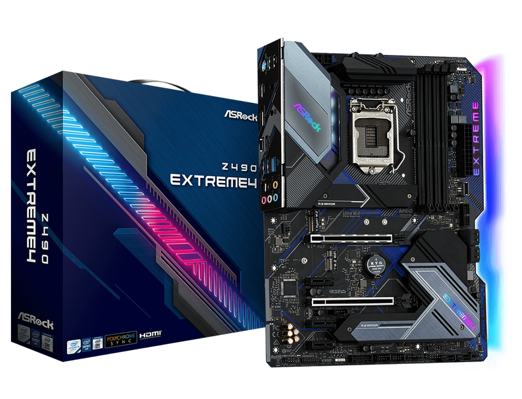
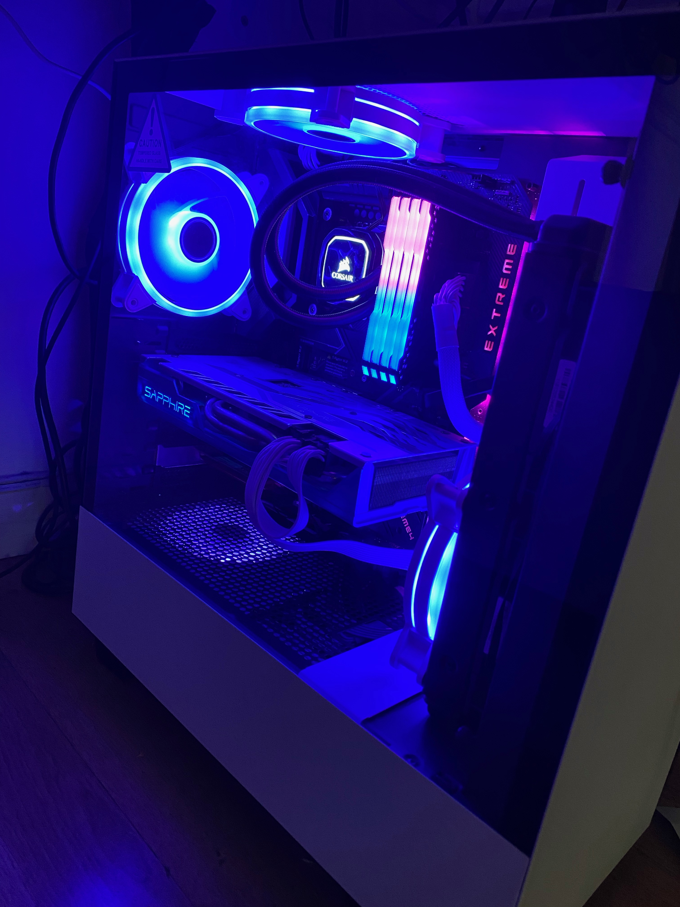
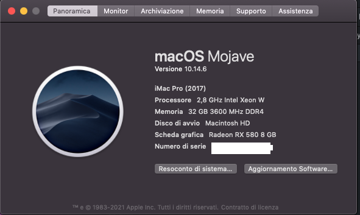
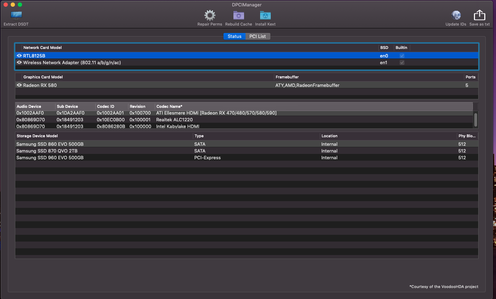
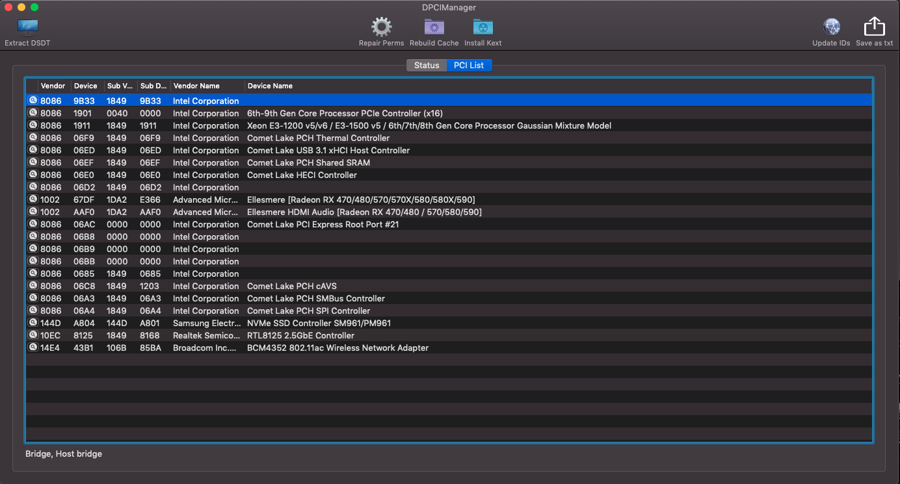

# ASROCK z490 EXTREME 4 

### Computer Spec:

| Component        | Brank                              |
| ---------------- | ---------------------------------- |
| CPU              | i9 10900         |
| iGPU             | Intel® UHD Graphics 630         | 
| DGPU             | RX 580 Special Edition 8GB       |       
| Audio            | Realtek ALC1220            |
| Ram              | 32GB 3200 Mhz DDR4  |            |
| Wifi             | BCM4352 - Asus PCE AC56  |
| Bluetooth             | ASUS BT400 |
| NVMe             | Samsung 960 512 GB          
| SSD             | Samsung 860 512 GB          
| SSD             | Samsung QVO 870 2TB                  
| SmBios    10.14.x       | iMac Pro 1,1     |     
| SmBios    10.15+       | iMac 20,2  |   
| BootLoader       | OpenCore 0.7.0                    

### What works and What doesn't or WIP:

- [x] Intel UHD 630 iGPU + HDMI AUDIO/HDMI/DP VIDEO
- [x] ALC1220 Internal Speaker and Headphones 
- [x] All USB Ports 
- [x] SpeedStep / Sleep / Wake
- [x] Wi-Fi Intel AC 9462
- [x] NVRAM
- [x] Windows boot from OpenCore

## Peripherals  Setting 

## Bios settings
### Enable :
* SATA Operation : AHCI
* XHCI Hand-Off
* ABOVE 4G
* XMP 2.0 Profile 1 or AUTO
* Primary Graphics Adapter : PEG

### Disable : 
* Secure Boot
* Intel SGX
* Fastboot
* CFG LOCK
* Boot From Onboard LAN
* CSM 
* IGPU Multi-Monitor

### Special Config:

- Usb port mapping performed
- SSDT-Hack Essential patch

## Credits

- [Apple](https://apple.com) for macOS;
- [Acidanthera](https://github.com/acidanthera) for OpenCore and all the lovely hackintosh work.
- [Dortania](https://github.com/dortania) For their detailed guides.
- [Vins95](https://github.com/Vins95)
- [Hackintoshlifeit](https://github.com/Hackintoshlifeit)
- [Lorys89](https://github.com/Lorys89/)

# If you need help please contact us on [Telegram](https://t.me/HackintoshLife_it) 
